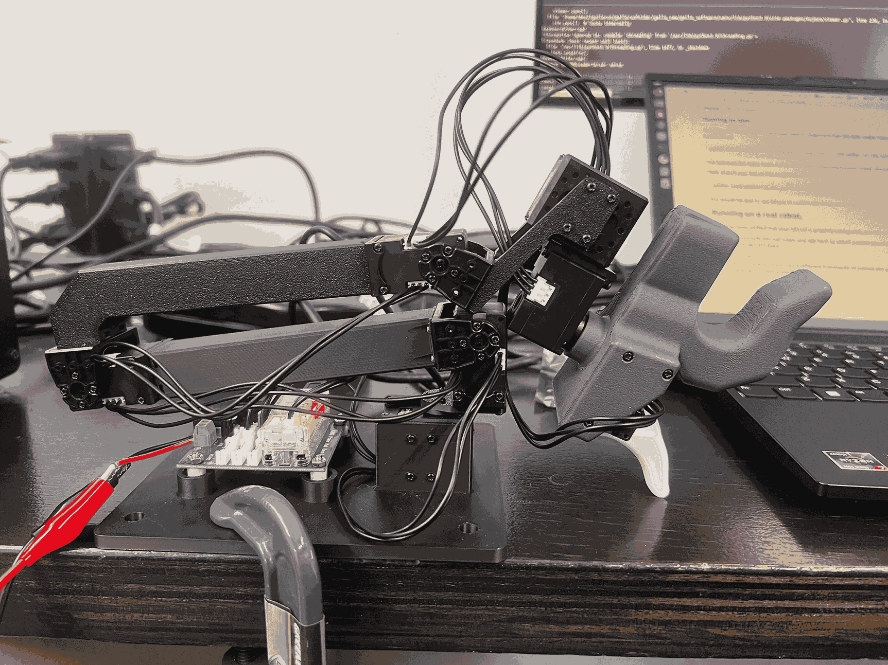

# GELLO: General, Low-Cost, and Intuitive Teleoperation Framework

<p align="center">
  
</p>

GELLO is a general, low-cost, and intuitive teleoperation framework for robot manipulators. This repository contains all the software components for GELLO. 

For additional resources:
- [Project Website](https://wuphilipp.github.io/gello_site/)
- [Hardware Repository](https://github.com/wuphilipp/gello_mechanical) - STL files and build instructions

## Quick Start

```bash
git clone https://github.com/wuphilipp/gello_software.git
cd gello_software
```

## Installation

### Option 1: Virtual Environment (Recommended)

First, install uv if you don't have it:
```bash
curl -LsSf https://astral.sh/uv/install.sh | sh
```

Create and activate a virtual environment:
```bash
uv venv --python 3.11
source .venv/bin/activate  # Run this every time you open a new shell
git submodule init
git submodule update
uv pip install -r requirements.txt
uv pip install -e .
uv pip install -e third_party/DynamixelSDK/python
```

### Option 2: Docker

Install [Docker](https://docs.docker.com/engine/install/ubuntu/), then:

```bash
docker build . -t gello:latest
python scripts/launch.py
```

### ROS 2 Support

> **Note:** GELLO also supports ROS 2 Humble for the Franka FR3 robot. See the [ROS 2-specific README](ros2/README.md) in the `ros2` directory.

## Hardware Configuration

### 1. Update Motor IDs

Install the [Dynamixel Wizard](https://emanual.robotis.com/docs/en/software/dynamixel/dynamixel_wizard2/).

Each Dynamixel motor defaults to ID 1. For multiple motors on one U2D2 controller, each needs a unique ID. Configure one motor at a time:

1. Connect a single motor to the controller
2. Open Dynamixel Wizard
3. Click scan (top left) to detect the motor
4. Change the ID address to the appropriate number
5. Repeat for each motor in order (base to gripper)

### 2. Extract Joint Offsets

Set GELLO to a known configuration and run the offset detection script:

<p align="center">
  
  
  
  
</p>

**UR Robot:**
```bash
python scripts/gello_get_offset.py \
    --start-joints 0 -1.57 1.57 -1.57 -1.57 0 \
    --joint-signs 1 1 -1 1 1 1 \
    --port /dev/serial/by-id/usb-FTDI_USB__-__Serial_Converter_FT7WBG6
```

**Franka FR3:**
```bash
python scripts/gello_get_offset.py \
    --start-joints 0 0 0 -1.57 0 1.57 0 \
    --joint-signs 1 1 1 1 1 -1 1 \
    --port /dev/serial/by-id/usb-FTDI_USB__-__Serial_Converter_FT7WBG6
```

**I2RT YAM:**
```bash
python scripts/gello_get_offset.py \
    --start-joints 0 0 0 0 0 0 \
    --joint-signs 1 -1 -1 -1 1 1 \
    --port /dev/serial/by-id/usb-FTDI_USB__-__Serial_Converter_FTAAMLV6-if00-port0
```

**Joint Signs Reference:**
- UR: `1 1 -1 1 1 1`
- Panda: `1 -1 1 1 1 -1 1`
- FR3: `1 1 1 1 1 -1 1`
- xArm: `1 1 1 1 1 1 1`
- YAM: `1 -1 -1 -1 1 1`

Add the generated joint offsets to `gello/agents/gello_agent.py` in the `PORT_CONFIG_MAP` or use the YAML method.

## Usage

### Testing in Simulation

1. Launch the robot node:
```bash
python experiments/launch_nodes.py --robot <sim_ur|sim_panda|sim_xarm|sim_yam>
```

2. Launch GELLO controller:
```bash
python experiments/run_env.py --agent=gello
```

### Real Robot Operation

Install robot-specific dependencies:
- **UR**: [ur_rtde](https://sdurobotics.gitlab.io/ur_rtde/installation/installation.html)
- **Panda**: [polymetis](https://facebookresearch.github.io/fairo/polymetis/installation.html)
- **xArm**: [xArm Python SDK](https://github.com/xArm-Developer/xArm-Python-SDK)
- **YAM**: [i2rt](https://github.com/i2rt-robotics/i2rt)

Launch the system:
```bash
python experiments/launch_nodes.py --robot=<your_robot>
python experiments/run_env.py --agent=gello
```

**YAM-specific commands:**
```bash
python experiments/launch_nodes.py --robot=yam
python experiments/run_env.py --agent=gello --start-joints 0 0 0 0 0 0 1
```

### Optional: Starting Configuration

Use `--start-joints` to specify GELLO's starting configuration for automatic robot reset:
```bash
python experiments/run_env.py --agent=gello --start-joints <joint_angles>
```

## Configuration System

### YAML Configuration Files

GELLO supports configuration-driven operation through YAML files in the `configs/` directory. This approach provides a flexible way to configure different robot setups, simulation environments, and teleoperation parameters.

#### Configuration Structure

Configuration files use a dependency injection pattern with `_target_` keys to specify Python classes:

```yaml
robot:
  _target_: gello.robots.yam.YAMRobot
  channel: "can_left"

agent:
  _target_: gello.agents.gello_agent.GelloAgent
  port: "/dev/serial/by-id/usb-FTDI_USB__-__Serial_Converter_FTA2U4GA-if00-port0"
  dynamixel_config:
    _target_: gello.agents.gello_agent.DynamixelRobotConfig
    joint_ids: [1, 2, 3, 4, 5, 6]
    joint_offsets: [0.0, 3.14159, 6.28318, 3.14159, 5.23599, 3.14159]
    joint_signs: [1, 1, -1, -1, 1, 1]
    gripper_config: [7, -30, 24]
  start_joints: [0.0, 0.0, 0.0, 0.0, 0.0, 0.0, 1.0]

hz: 30
max_steps: 1000
```

#### Generating Configuration Files

Configuration file generation is only currently supported for the YAM Gello. Generating a config file through this process allows you to skip the manual joint angle calibration process.

Run `python scripts/generate_yam_config.py`

#### Using Configuration Files

Launch GELLO with a configuration file:
```bash
python launch_yaml.py --config-path configs/test.yaml          # Hardware robot
python launch_yaml.py --config-path configs/test_sim.yaml     # Simulation
```

#### Creating Custom Configurations

1. Copy an existing config from `configs/` as a template
2. Modify the robot `_target_` and parameters for your setup:
   - For hardware: `gello.robots.yam.YAMRobot`, `gello.robots.ur.URRobot`, etc.
   - For simulation: `gello.robots.sim_robot.MujocoRobotServer`
3. Update the agent configuration with your GELLO device settings:
   - `port`: Your U2D2 device path
   - `joint_offsets`: From the offset detection script
   - `joint_signs`: Based on your robot type
   - `start_joints`: Your GELLO's starting position

#### Configuration Components

- **Robot Config**: Defines robot type, communication parameters, and physical settings
- **Agent Config**: Defines GELLO device settings, joint mappings, and calibration
- **DynamixelRobotConfig**: Motor-specific settings including IDs, offsets, signs, and gripper
- **Control Parameters**: Update rates (`hz`), step limits (`max_steps`), and safety settings

## Advanced Features

### Data Collection

Collect teleoperation demonstrations with keyboard controls:
```bash
python experiments/run_env.py --agent=gello --use-save-interface
```

Process collected data:
```bash
python gello/data_utils/demo_to_gdict.py --source-dir=<source_dir>
```

### Bimanual Operation

```bash
python experiments/launch_nodes.py --robot=bimanual_ur
python experiments/run_env.py --agent=gello --bimanual
```

### Process Management

Kill all Python processes if needed:
```bash
./kill_nodes.sh
```

## Development

### Code Organization

- `scripts/`: Helpful Python scripts
- `experiments/`: Entry points into GELLO code
```

Set up pre-commit hooks:
```bash
uv pip install pre-commit
pre-commit install
```

The codebase uses `isort` and `black` for code formatting.

We welcome contributions! Submit pull requests to help make teleoperation more accessible and higher quality.

## Citation

```bibtex
@misc{wu2023gello,
    title={GELLO: A General, Low-Cost, and Intuitive Teleoperation Framework for Robot Manipulators},
    author={Philipp Wu and Yide Shentu and Zhongke Yi and Xingyu Lin and Pieter Abbeel},
    year={2023},
}
```

## License & Acknowledgements

This project is licensed under the MIT License (see LICENSE file).

### Third-Party Dependencies
- [google-deepmind/mujoco_menagerie](https://github.com/google-deepmind/mujoco_menagerie): Robot models for MuJoCo
- [brentyi/tyro](https://github.com/brentyi/tyro): Argument parsing and configuration
- [ZMQ](https://zeromq.org/): Multiprocessing communication framework