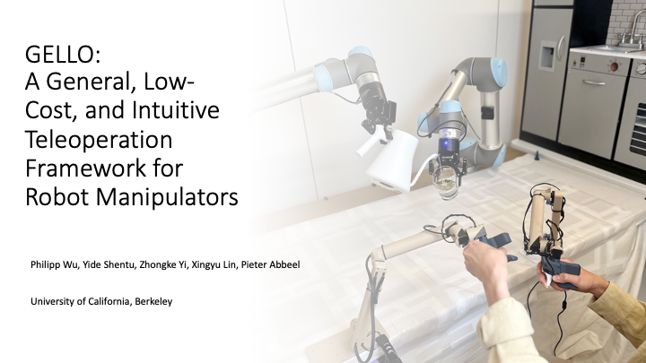
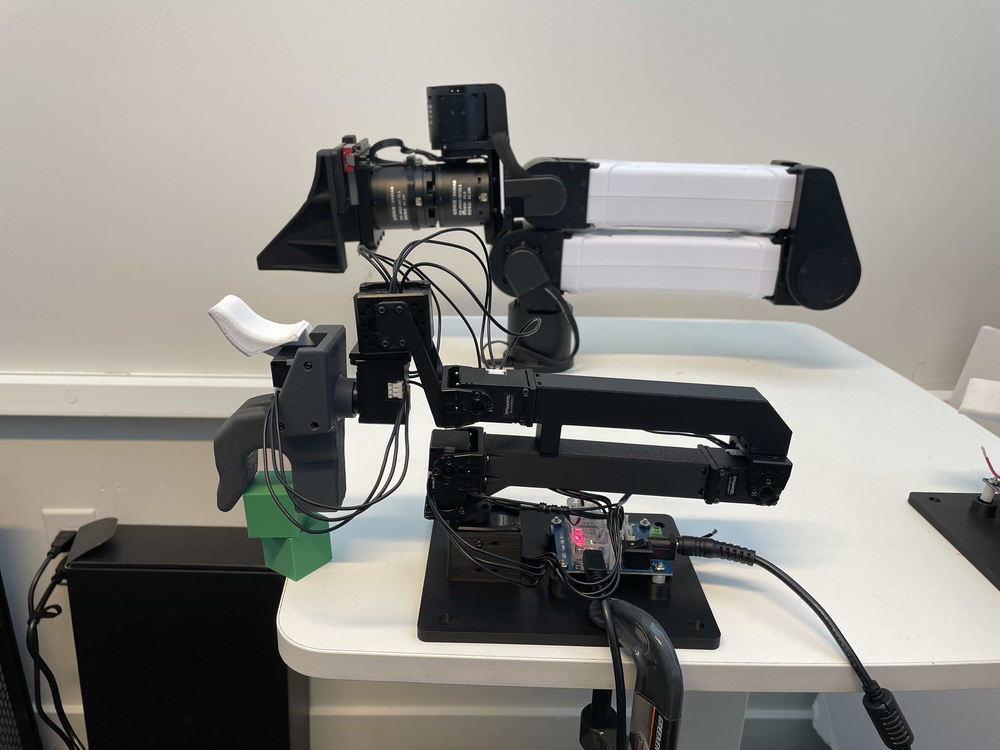
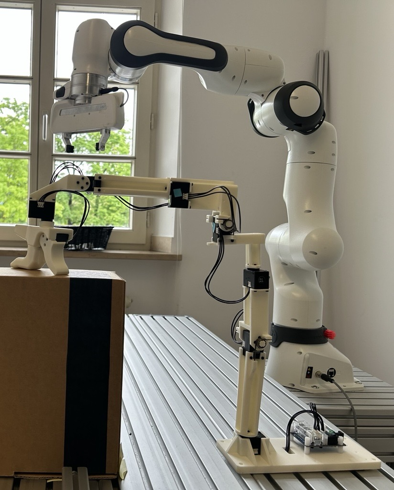

# GELLO: General, Low-Cost, and Intuitive Teleoperation Framework

<p align="center">
  
</p>

GELLO is a general, low-cost, and intuitive teleoperation framework for robot manipulators. This repository contains all the software components for GELLO. 

For additional resources:
- [Project Website](https://wuphilipp.github.io/gello_site/)
- [Hardware Repository](https://github.com/wuphilipp/gello_mechanical) - STL files and build instructions
- [ROS 2 Support](ros2/README.md)

## Quick Start

```bash
git clone https://github.com/wuphilipp/gello_software.git
cd gello_software
```

## Installation

### Option 1: Virtual Environment (Recommended)

First, install uv if you don't have it:
```bash
curl -LsSf https://astral.sh/uv/install.sh | sh
```

Create and activate a virtual environment:
```bash
uv venv --python 3.11
source .venv/bin/activate  # Run this every time you open a new shell
git submodule init
git submodule update
uv pip install -r requirements.txt
uv pip install -e .
uv pip install -e third_party/DynamixelSDK/python
```

### Option 2: Docker

Install [Docker](https://docs.docker.com/engine/install/ubuntu/), then:

```bash
docker build . -t gello:latest
python scripts/launch.py
```

### ROS 2 Support

> **Note:** GELLO also supports ROS 2 Humble for the Franka FR3 robot. See the [ROS 2-specific README](ros2/README.md) in the `ros2` directory.

## Hardware Configuration

The recommended setup for GELLO is with the I2RT YAM robot arm, using the YAML-based configuration system. This provides the most features and is the best-supported configuration.

### Generate YAML Configuration

For the I2RT YAM robot, you can automatically generate your configuration files. This process calibrates the joint offsets and creates configuration files for both simulation and real hardware.

1.  **Update Motor IDs**: Before generating the config, ensure each Dynamixel motor has a unique ID. Install the [Dynamixel Wizard](https://emanual.robotis.com/docs/en/software/dynamixel/dynamixel_wizard2/) and follow these steps:
    1.  Connect a single motor to the U2D2 controller.
    2.  Open Dynamixel Wizard and scan to detect the motor.
    3.  Change the ID to a unique number (e.g., 1 through 7).
    4.  Repeat for each motor, ensuring they are in order from base to gripper.

2.  **Run the Generation Script**: With the YAM arm in its default build position (see image below), run the script:
    ```bash
    python scripts/generate_yam_config.py
    ```
    Follow the prompts in the terminal. This will create `configs/yam_auto_generated.yaml` for the real robot and `configs/yam_auto_generated_sim.yaml` for the simulation.

<p align="center">
  
</p>

You can now skip to the [Usage](#usage) section.

### YAML Configuration System

GELLO uses YAML files in `configs/` for configuration. This allows for flexible setup of different robots, environments, and teleoperation parameters. If you have automatically generated your `.yaml` config files with `scripts/generate_yam_config.py`, you probably will not need to modify these confings manually.

#### Sample Configs

Sample configs for the YAM arm and the xarm can be found in `configs`.


#### Configuration Components

- **Robot Config**: Defines robot type, communication parameters, and physical settings.
- **Agent Config**: Defines GELLO device settings, joint mappings, and calibration.
- **DynamixelRobotConfig**: Motor-specific settings including IDs, offsets, signs, and gripper.
- **Control Parameters**: Update rates (`hz`), step limits (`max_steps`), and safety settings.

## Manual Configuration for Other Robots

#### Python Configuration for Non-YAM arms
- Most widely supported across different arms
- Located in `gello/agents/gello_agent.py`
- Uses `PORT_CONFIG_MAP` dictionary
- Maps USB serial ports to robot configurations

#### ROS 2 YAML configs for Franka
- Used for ROS 2 packages
- Runtime configuration loading
- Located in `ros2/src/franka_gello_state_publisher/config/gello_config.yaml`

## Adding New Robots

To integrate a new robot to the Python configs:

1. **Check Compatibility**: Ensure your GELLO kinematics match the target robot
2. **Implement Robot Interface**: Create a new class implementing the `Robot` protocol from `gello/robots/robot.py`
3. **Add Configuration**: Update the configuration system with your robot's parameters

See existing implementations in `gello/robots/` for reference:
- `panda.py` - Franka Panda robot
- `ur.py` - Universal Robots
- `xarm_robot.py` - xArm robots
- `yam.py` - YAM robot

=======

#### 1. Manual `gello_agent` setup
Set your GELLO and robot arm to a known, matching configuration (see images below) and run the offset detection script.

<p align="center">
  
  
  
</p>

**Command examples:**

**UR Robot:**
```bash
python scripts/gello_get_offset.py \
    --start-joints 0 -1.57 1.57 -1.57 -1.57 0 \
    --joint-signs 1 1 -1 1 1 1 \
    --port /dev/serial/by-id/usb-FTDI_USB__-__Serial_Converter_FT7WBG6
```

**Franka FR3:**
```bash
python scripts/gello_get_offset.py \
    --start-joints 0 0 0 -1.57 0 1.57 0 \
    --joint-signs 1 1 1 1 1 -1 1 \
    --port /dev/serial/by-id/usb-FTDI_USB__-__Serial_Converter_FT7WBG6
```

**I2RT YAM:**
```bash
python scripts/gello_get_offset.py \
    --start-joints 0 0 0 0 0 0 \
    --joint-signs 1 -1 -1 -1 1 1 \
    --port /dev/serial/by-id/usb-FTDI_USB__-__Serial_Converter_FTAAMLV6-if00-port0
```

**Joint Signs Reference:**
- UR: `1 1 -1 1 1 1`
- Panda: `1 -1 1 1 1 -1 1`
- FR3: `1 1 1 1 1 -1 1`
- xArm: `1 1 1 1 1 1 1`
- YAM: `1 -1 -1 -1 1 1`

Add the generated joint offsets to `gello/agents/gello_agent.py` in the `PORT_CONFIG_MAP`.

#### 2. Create Custom YAML Configurations

1. Copy an existing config from `configs/` as a template (e.g., `yam_passive.yaml`).
2. Modify the robot `_target_` and parameters for your setup:
   - For hardware: `gello.robots.ur.URRobot`, `gello.robots.panda.PandaRobot`, etc.
   - For simulation: `gello.robots.sim_robot.MujocoRobotServer`
3. Update the agent configuration with your GELLO device settings:
   - `port`: Your U2D2 device path
   - `joint_offsets`: From the offset detection script
   - `joint_signs`: Based on your robot type
   - `start_joints`: Your GELLO's starting position

## Usage

The recommended way to launch GELLO is with a YAML configuration file.

### CAN Configuration
Robot arms such as the YAM use a CAN bus to communicate with your machine. If your arm uses a CAN bus, you will need to configure udev rules.
First, get your CAN bus ID:
```
udevadm info -a -p /sys/class/net/can* | grep -i serial
```
Then open your CAN bus rules using your text editor of choice.
```
sudo nano /etc/udev/rules.d/90-can.rules
```
If you only have one arm, add this line:
```
SUBSYSTEM=="net", ACTION=="add", ATTRS{serial}=="<your-CAN-id>", NAME="can_left"
```
If you have two arms (a bimanual setup), you will need a second line for your right arm. Your bimanual CAN rules file should contain:
```
SUBSYSTEM=="net", ACTION=="add", ATTRS{serial}=="<left-CAN-id>", NAME="can_left"
SUBSYSTEM=="net", ACTION=="add", ATTRS{serial}=="<right-CAN-id>", NAME="can_right"
```

After updating your udev rules, run the following and then unplug and reconnect your CAN devices.
```
sudo udevadm control --reload-rules && sudo systemctl restart systemd-udevd && sudo udevadm trigger
```
At this point, your CAN devices are correctly configured. If you encounter CAN connctivity issues after this point run `sh scripts/reset_all_can.sh` to reset your CAN buses.

### YAM GELLO Usage (Recommended)

First, install the YAM-specific dependency:
- **YAM**: [I2RT](https://github.com/i2rt-robotics/i2rt)
- `uv pip install -e third_party/i2rt`

**Testing in Simulation:**
Launch the simulation with the auto-generated sim config file:
```bash
python experiments/launch_yaml.py --left-config-path configs/yam_auto_generated_sim.yaml
```

**Real Robot Operation:**
Launch the real robot with the auto-generated hardware config file:
```bash
python experiments/launch_yaml.py --left-config-path configs/yam_auto_generated.yaml
```

### Launching `gello_agent` for non-YAM arms

For other robots or if not using a YAML configuration, you must launch the robot and controller nodes in separate terminals.

First, install robot-specific dependencies:
- **UR**: [ur_rtde](https://sdurobotics.gitlab.io/ur_rtde/installation/installation.html)
- **Panda**: [polymetis](https://facebookresearch.github.io/fairo/polymetis/installation.html)
- **xArm**: [xArm Python SDK](https://github.com/xArm-Developer/xArm-Python-SDK)

**1. Launch the robot node:**
```bash
# For simulation
python experiments/launch_nodes.py --robot <sim_ur|sim_panda|sim_xarm>

# For real hardware
python experiments/launch_nodes.py --robot <ur|panda|xarm>
```

**2. Launch GELLO controller:**
```bash
python experiments/run_env.py --agent=gello
```

### Troubleshooting

If, when you run `generate_yam_config.py`, you get an error detecting offsets, you may need to add your user to the dialout user group. To do so, run:
`sudo usermod -aG dialout $USER`
And then log out and log back in or restart your computer.s

If some joints in your arm are not behaving as expected, you may need to modify the joint signs of your configuration. Simply invert the affected joint sign(s) in your .yaml or `gello_agent.py` or physically reverse the installation of the servo.

### Optional: Starting Configuration

Use `--start-joints` to specify GELLO's starting configuration for automatic robot reset:
```bash
python experiments/run_env.py --agent=gello --start-joints <joint_angles>
```

## Advanced Features

### Data Collection

Collect teleoperation demonstrations with keyboard controls.

For the YAM arm launched with `launch_yaml.py`, you can append the flag `--use-save-interface` to enable data saving. This is the recommended method.

```
python experiments/launch_yaml.py --left-config-path configs/yam_passive.yaml --use-save-interface
```
After launching, you can begin saving with `s` and stop saving with `q`. Data saved will be in the `data` directory in the root of the project.

For non-YAM setups, use the following:
```bash
python experiments/run_env.py --agent=gello --use-save-interface
```
Process collected data:
```bash
python gello/data_utils/demo_to_gdict.py --source-dir=<source_dir>
```

### Bimanual Operation

The recommended way to use bimanual mode is with `launch_yaml.py`. Pass a config file for the right arm to `--right-config-path`.

```
python experiments/launch_yaml.py --left-config-path configs/gello_1.yaml --right-config-path configs/gello_2.yaml
```

For non-YAM setups, use:
```bash
python experiments/launch_nodes.py --robot=bimanual_ur
python experiments/run_env.py --agent=gello --bimanual
```
### FACTR Gravity Compensation
If you want to activate gravity compensation, all the code can be found in `gello/factr`. It works similarly to the regular launch but for now it's self-contained inside its own subdirectory and supports the YAM arm in sim and in hardware.

The YAML provides important fields that can control the strength of the gravity compensation and friction. Feel free to mess around with the strenght and friction til you attain your desired 

One important step is to add the URDF. We have provided the URDF for the active GELLO in the [Hardware Repository](https://github.com/wuphilipp/gello_mechanical). You will need to update the path in the YAML to the entry point of the URDF. 
```bash
python gello/factr/gravity_compensation.py --config configs/yam_gello_factr_hw.yaml

```

## Development

### Code Organization

```
├── scripts/             # Utility scripts
├── experiments/         # Entry points and launch scripts
├── gello/               # Core GELLO package
│   ├── agents/          # Teleoperation agents
│   ├── cameras/         # Camera interfaces
│   ├── data_utils/      # Data processing utilities
│   ├── dm_control_tasks/# MuJoCo environment utilities
│   ├── dynamixel/       # Dynamixel hardware interface
|   ├── factr/           # gravity compensation
│   ├── robots/          # Robot-specific interfaces
│   ├── utils/           # Shared launch and control utilities
│   └── zmq_core/        # ZMQ multiprocessing utilities
```

### Contributing

Install development dependencies and set up pre-commit hooks to ensure code quality before contributing:
```bash
uv pip install -r requirements_dev.txt
uv pip install pre-commit
pre-commit install
```

The codebase uses `isort` and `black` for code formatting.

We welcome contributions! Submit pull requests to help make teleoperation more accessible and higher quality.

## Citation

```bibtex
@misc{wu2023gello,
    title={GELLO: A General, Low-Cost, and Intuitive Teleoperation Framework for Robot Manipulators},
    author={Philipp Wu and Yide Shentu and Zhongke Yi and Xingyu Lin and Pieter Abbeel},
    year={2023},
}
```

## License & Acknowledgements

This project is licensed under the MIT License (see LICENSE file).

### Third-Party Dependencies
- [google-deepmind/mujoco_menagerie](https://github.com/google-deepmind/mujoco_menagerie): Robot models for MuJoCo
- [brentyi/tyro](https://github.com/brentyi/tyro): Argument parsing and configuration
- [ZMQ](https://zeromq.org/): Multiprocessing communication framework

This project uses components from ‘FACTR Teleop: Low-Cost Force-Feedback Teleoperation’ (Apache‑2.0). See `https://github.com/RaindragonD/factr_teleop/`.
